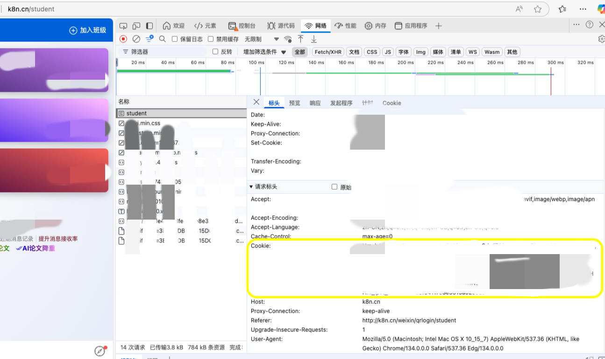

# dus -- 班级魔方GPS自动签到

> ### 👉 现已提供跨平台桌面应用程序，支持Windows/macOS/Linux，无需安装Node.js环境！
> ### 👉 [点击此处](https://github.com/yclw/dus/releases/latest)直接下载最新版本安装包
> ### 👉 下载对应您系统的安装包，双击即可安装使用，简单便捷！

一个用于班级魔方的自动GPS签到工具，支持多用户、定时任务和消息推送。提供命令行和图形界面两种使用方式。

## 特点

- **多用户支持**: 支持配置多个Cookie，同时为多个用户进行签到
- **自动获取信息**: 自动获取班级列表，无需手动输入班级ID
- **自动识别用户**: 自动识别Cookie对应的用户名，提升用户体验
- **定时任务**: 支持配置的定时任务
- **消息推送**: 支持使用PushPlus进行签到结果通知
- **GPS模拟**: 模拟GPS坐标偏移，使签到位置更真实
- **图形界面**: 提供基于Electron的桌面图形界面，操作更直观
- **开机自启动**: 支持系统开机时自动启动应用（桌面版）

## 项目结构

```
├── package.json           # 项目配置文件
├── README.md              # 项目说明文档
├── main.js                # Electron主进程入口
├── preload.js             # Electron预加载脚本
├── renderer/              # Electron渲染进程目录
└── src                    # 源代码目录
    ├── index.js           # 命令行工具入口文件
    ├── config/            # 配置管理
    │   ├── index.js       # 配置操作基础方法
    │   └── setup.js       # 配置初始化
    ├── users/             # 用户管理
    │   └── index.js       # 用户信息获取
    ├── signin/            # 签到功能
    │   └── index.js       # 签到相关功能
    ├── cli/               # 命令行处理
    │   └── index.js       # 命令行参数处理
    └── utils/             # 工具函数
        ├── logger.js      # 日志工具
        ├── gps.js         # GPS坐标处理
        └── notify.js      # 通知推送
```

## 安装

```bash
# 下载安装Node.js
# 访问 https://nodejs.org/zh-cn/ 下载安装最新LTS版本

# 克隆仓库
git clone https://github.com/yclw/dus.git
cd dus

# 安装依赖
npm install
```

## 使用方法

本工具提供两种使用方式：命令行工具和桌面应用程序。

### 方式一：命令行工具

适合服务器部署或喜欢命令行操作的用户。

#### 初始化配置

```bash
# 使用npm脚本
npm run init

# 或者使用命令行
node src/index.js --init
```

#### 执行签到

```bash
# 使用npm脚本
npm run sign

# 或者使用命令行
node src/index.js --sign
```

#### 设置日志级别

```bash
# 设置日志级别为info、warning或error
node src/index.js --log info
```

### 方式二：桌面应用程序

适合普通用户，提供图形界面，操作更加直观友好。

#### 启动应用

```bash
# 启动应用
npm start
```

#### 开发模式

```bash
# 开发模式启动（显示开发者工具）
npm run dev
```

#### 打包应用

```bash
# 打包为桌面应用安装包
npm run build
```

#### 桌面应用主要功能

- **配置管理**: 可视化编辑所有配置项
  - 定时任务时间设置
  - GPS坐标配置
  - 班级自动获取
  - 推送通知配置
  - 多用户Cookie管理
  - 开机自启动设置

- **签到功能**
  - 支持手动触发签到
  - 定时自动签到
  - 实时显示签到结果
  - 通知系统

## 配置说明

初始化配置时，您需要提供以下信息：

1. **Cookie**: 从班级魔方网站获取，可以配置多个（输入空行结束）
2. **班级ID**: 可以从获取的班级列表中选择，也可以手动输入
3. **GPS坐标**: 签到位置的经纬度
4. **海拔/精度**: 签到位置的海拔值或精度
5. **PushPlus Token**: 用于推送签到结果（可选）
6. **定时任务**: 定时任务配置（可选）

### Cookie获取教程

1. 使用Chrome或Edge浏览器打开[班级魔方](https://k8n.cn/student/)并登录您的账号
2. 登录成功后，按F12键或右键点击页面空白处选择"检查"打开开发者工具
3. 在开发者工具中切换到"网络/Network"选项卡
4. 刷新页面或者在页面上随意点击一个功能（例如"我的班级"）
5. 在Network选项卡中找到任意一个XHR请求，点击查看
6. 在请求头(Headers)中找到"Cookie"字段
7. 复制整个Cookie字段的内容
8. 将复制的内容粘贴到本工具的配置中



## 多用户支持

本工具支持同时为多个用户进行签到：

- 配置时可输入多个Cookie
- 程序会自动获取每个Cookie对应的用户名
- 签到结果会显示每个用户的成功/失败状态
- 支持自动检测并提示Cookie失效的情况

## 温馨提示

- 请确保提供的Cookie有效
- GPS坐标请使用有效的经纬度格式
- 使用桌面应用版本可以更方便地管理配置和执行签到
- 首次使用时，建议先验证Cookie，然后获取班级列表
- 设置开机自启动功能可能需要管理员权限